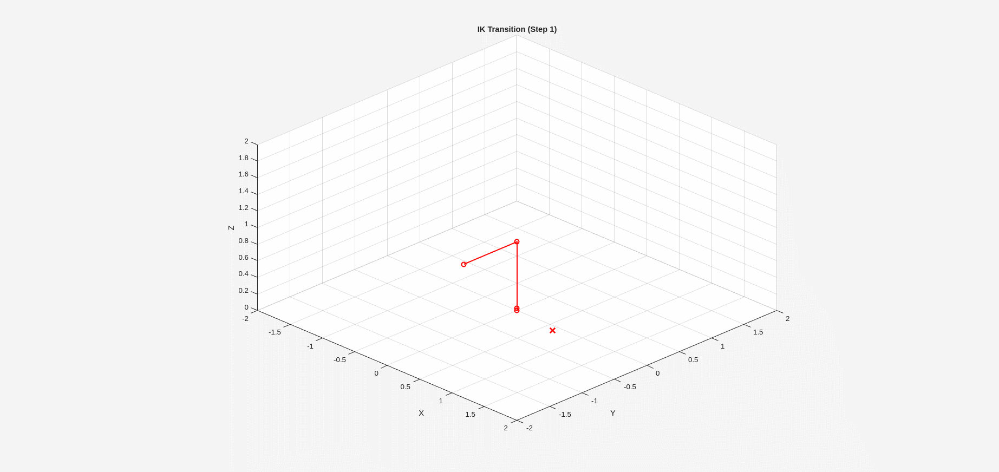
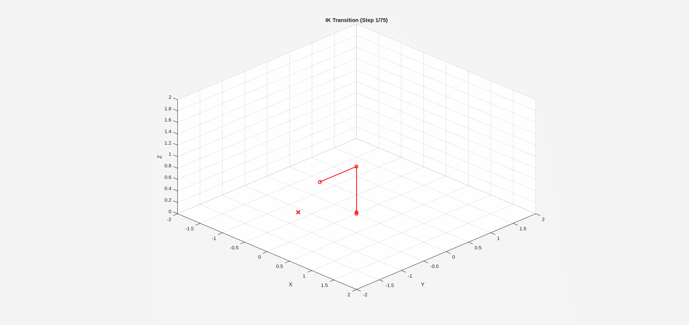

# 🤖 3-DOF Robotic Arm Control and Simulation

### **Advanced-Robotic-Manipulator-Kinematics-Dynamics-and-Hardware-Interface**

This repository provides a complete MATLAB implementation for simulating the **kinematics, differential kinematics, dynamics, trajectory planning, and control** of a 3-Degree-of-Freedom R-R-R robotic arm. It also includes a fully functional **Arduino interface** to actuate a real robot based on simulation results.

-----

## ✨ Simulation and Control in Action

The animations below demonstrate the key steps of the robotic pipeline: Inverse Kinematics calculation, smooth trajectory planning, and accurate tracking via Computed Torque Control.

| Inverse Kinematics Transition | Inverse Kinematics Transition |
| :---: | :---: |
|  |  |
-----

## 🌟 Project Overview

This project solves the full pipeline of robotic motion:

  * How to compute **where the robot is** (**Forward Kinematics**)
  * How to compute **how to reach a target point** (**Inverse Kinematics**)
  * How to map **joint velocities ↔ end-effector velocities** (**Differential Kinematics**)
  * How to compute **torques required to follow a trajectory** (**Dynamics**)
  * How to **control the robot smoothly** (**CTC**)
  * How to **run the robot on real hardware** (**Arduino**)

### 🟦 Forward Kinematics (FK)

Computes the end-effector position ($P_{ee}$) from joint angles ($q$):

$$
P_{ee} = f(q)
$$


### 🟩 Inverse Kinematics (IK)

Computes the joint angles ($\mathbf{q}$) to reach a desired 3D point $\boldsymbol{\mu}_a$. Implemented using **Damped Least Squares (DLS)** for robustness near singularities:
$$\dot{\mathbf{q}} = J^\top (JJ^\top + \lambda^2 I)^{-1} (\mathbf{x}_d - \mathbf{x})$$

### 🟪 Differential Kinematics

Uses the **Jacobian matrix ($\mathbf{J}$)** to compute end-effector velocity ($\dot{\mathbf{x}}$) from joint velocity ($\dot{\mathbf{q}}$):
$$\dot{\mathbf{x}} = J(\mathbf{q}) \dot{\mathbf{q}}$$

### 🟧 Dynamics (Euler–Lagrange)

The dynamic model includes:

  * $M(\mathbf{q})$: Inertia matrix
  * $C(\mathbf{q}, \dot{\mathbf{q}})$: Coriolis & centripetal matrix
  * $G(\mathbf{q})$: Gravity vector
    Used to simulate realistic robot motion.

### 🔴 Computed Torque Control (CTC)

A nonlinear control law using the dynamic model :
$$\boldsymbol{\tau} = M(q)(\ddot{q}_d + K_v \dot{e} + K_p e) + C(q, \dot{q}) \dot{q} + G(q)$$
Ensures **stable and accurate trajectory tracking**.

-----

## 🛠️ Features and Algorithms

### 🔹 Kinematics, Trajectory Planning, & Motion Control

  * **Forward Kinematics** (symbolic DH approach)
  * **Inverse Kinematics** via DLS
  * **Differential Kinematics** (Jacobian matrix)
  * **Cubic polynomial trajectory planning**
  * **Workspace computation** and visualization (3D)

### 🔹 Dynamics & Control

  * Nonlinear **dynamics** model: $M, C, G$
  * **Computed Torque Control** (CTC)
  * Tracking of joint-space and end-effector trajectories

### 🔹 Hardware Integration

  * Serial communication with **Arduino** (`J1:161` format)
  * Real-time actuation of servos / motors
  * Safe communication protocol with parsing and validation

-----

## 📁 File Structure

| File/Folder | Purpose | Description |
| :--- | :--- | :--- |
| `advanced_robot_manipulator.m` | **Main Control Script** | Implements FK, IK, Differential Kinematics, Dynamics, Trajectory Planning, and CTC |
| `workspace.m` | **Workspace Analysis** | Computes reachable 3D workspace using brute-force sampling |
| `Matlab_Arduino/` | **Hardware Interface** | Contains Arduino communication files |
| `Matlab_Arduino/Matlab_Arduino.ino` | **Arduino Sketch** | Parses incoming commands like `J1:161` and moves servos |

-----

## 🚀 How to Use the Code

### 1️⃣ Prerequisites

  * MATLAB (R2020b or later)
  * Symbolic Math Toolbox
  * Arduino IDE
  * (Optional) MATLAB Arduino Support Package

### 2️⃣ Setup Instructions

### Step 1: Clone the Repository

```bash
git clone https://github.com/rahul-r-joshua/Advanced-Robotic-Manipulator-Kinematics-Dynamics-and-Hardware-Interface.git
```

### Step 2: Flash Arduino Firmware

Upload the sketch:

```bash
Matlab_Arduino/Matlab_Arduino.ino
```

Open in **Arduino IDE**

Select board and port

Click **Upload**

-----

### 3️⃣ Running the Simulation

Open **MATLAB** and execute the desired script(s). The two primary scripts are designed for different purposes:

  * **1. Control, Dynamics, and Trajectory Simulation**

    Runs the full closed-loop control simulation (IK, CTC, Dynamics) and generates the performance plots (Figures 1-12).

    ```matlab
    run('advanced_robot_manipulator.m');
    ```

  * **2. Workspace Visualization**

    Computes and generates the **3D visualization** of the robot's reachable workspace using brute-force sampling, demonstrating the physical limits of the arm.

    ```matlab
    run('workspace.m');
    ```

-----

This script will:

  * Solve **IK** to reach the target
  * Generate smooth cubic joint **trajectories**
  * Simulate **dynamics** with **CTC**
  * Plot motion, errors, and torques
  * Optionally send final joint angles to Arduino

-----


## 📊 Simulation Results and Analysis Plots

| Figure Number | File Name | Key Information Demonstrated | Robotics Concept |
| :---: | :--- | :--- | :--- |
| **Figure 1** | `Home Position` | Initial configuration of the robot (Start Pose). | **Forward Kinematics (FK)** |
| **Figure 2** | `IK Animation` | Animation showing the robot moving from the Home Pose to the Final IK Pose. | **Inverse Kinematics (IK)** |
| **Figure 3** | `Final IK` | Static image of the robot at the target position, defined by the IK solution. | **Inverse Kinematics (IK)** |
| **Figure 4** | `Planned Trajectory Path` | 3D view of the smooth, desired path the end-effector is supposed to follow. | **Trajectory Planning** |
| **Figure 5** | `Control Simulation` | Animation/Trace showing the actual (simulated) path followed by the robot compared to the desired path. | **Closed-Loop Control** |
| **Figure 6** | `Final Control Configuration` | Static image of the final robot configuration after the control simulation ends. | **Closed-Loop Control** |
| **Figure 7** | `Joint Position Tracking Performance` | **Desired vs. Actual** joint angle ($\mathbf{q}$) over time, showing tracking error. | **Control Performance** |
| **Figure 8** | `Control Torque Effort` | Total torque ($\boldsymbol{\tau}$) applied by each motor over time (Nm). | **Computed Torque Control (CTC)** |
| **Figure 9** | `Actual End-Effector Acceleration Propagation` | End-effector acceleration ($\ddot{\mathbf{x}}$) calculated from $\mathbf{J}\ddot{\mathbf{q}} + \dot{\mathbf{J}}\dot{\mathbf{q}}$. | **Differential Kinematics** |
| **Figure 10** | `Joint Position Tracking` | Another view of the **Desired vs. Actual** joint angle ($\mathbf{q}$) tracking performance. | **Control Performance** |
| **Figure 11** | `Control_Torque Vector Trajectory` | Components of the control torque vector ($\tau_1, \tau_2, \tau_3$) over time. | **Dynamics/CTC** |
| **Figure 12** | `End Effector Acceleration` | Components of the end-effector acceleration ($\ddot{x}_{ee}, \ddot{y}_{ee}, \ddot{z}_{ee}$). | **Differential Kinematics** |

### ⚠️ Important Hardware Note

The script attempts to connect to `/dev/ttyACM0` (Linux/Mac default).

If you **DO NOT** have a robot connected:
❗ **Comment out Section 10: "Hardware Interface (Arduino)"** in `advanced_robot_manipulator.m` to avoid serial port errors.

If you **ARE** using a robot:

1.  **Crucial Step: Close Arduino IDE**
    After flashing the firmware (`Matlab_Arduino.ino`), **you must close the Arduino IDE (and the Serial Monitor)**. Only one program can access the serial port at a time. If the IDE is open, MATLAB will report an error.

2.  **Update Port Settings**
    Update the `port` variable in MATLAB's Section 10 to match your system:
    * Windows → `"COM3"`
    * Linux → `"/dev/ttyACM0"`
    * Mac → `"/dev/cu.usbmodemXXXX"`

3.  **Check Power**
    Ensure servo power and ground are properly connected.

***


### 🎯 Summary of Capabilities

| Capability | Supported |
| :--- | :--- |
| Forward Kinematics | ✅ |
| Inverse Kinematics (DLS) | ✅ |
| Differential Kinematics | ✅ |
| Full Dynamics (M, C, G) | ✅ |
| Cubic Trajectory Planning | ✅ |
| Computed Torque Control | ✅ |
| Workspace Visualization | ✅ |
| Arduino Real-Time Control | ✅ |
